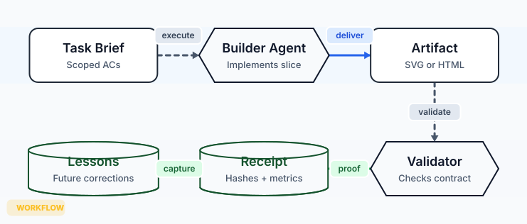

# visual-architecture

[](https://github.com/LeoStehlik/visual-architecture/actions/workflows/validate.yml)

**Deterministic, local-first architecture artifacts for agents.**

visual-architecture turns small typed JSON specs into restrained SVG or self-contained HTML system maps. The v0.3 contract is simple: validate the spec, render the artifact, and write a receipt with hashes so an agent can prove exactly what it delivered.

It is deliberately smaller than Archify today, but the direction is not timid: local-first diagram artifacts with proof discipline, source evidence, PR deltas, and review-ready examples.



## Why It Exists

Agents are good at inventing diagrams and bad at proving what they just drew. visual-architecture gives them a narrow, deterministic path:

1. Author a compact JSON spec.
2. Validate supported node kinds, edge kinds, endpoints, grid placement, and obvious route hazards.
3. Deliver SVG or HTML atomically.
4. Emit a JSON receipt with input/output SHA-256, byte counts, metrics, warnings, and validation result.

The output stays boring in the useful way: clean routes, readable labels, no hosted service, no drawing editor, no mystery auto-layout.

## Install

### OpenClaw / ClawHub

```bash
openclaw skills install visual-architecture
```

### Manual

```bash
git clone https://github.com/LeoStehlik/visual-architecture.git ~/.openclaw/workspace/skills/visual-architecture
```

For Codex, Claude Code, OpenCode, or another agent harness, copy this repo or the `SKILL.md` plus `scripts/` and `examples/` into the harness skill directory.

## Quick Start

Validate a spec:

```bash
python3 scripts/render_architecture.py validate examples/service-map.json --json
```

Render a static SVG:

```bash
python3 scripts/render_architecture.py deliver examples/service-map.json examples/service-map.svg --json
```

Deliver a self-contained HTML artifact:

```bash
python3 scripts/render_architecture.py deliver examples/agent-runtime.json examples/agent-runtime.html --json
```

The legacy v0.2 command still works:

```bash
python3 scripts/render_architecture.py examples/service-map.json examples/service-map.svg
```

## Proof Gallery

These are checked-in specs and generated artifacts, not mockups.

| Scenario | Source | SVG | HTML | Receipt |
|---|---|---|---|---|
| Service map | [`service-map.json`](examples/service-map.json) | [`service-map.svg`](examples/service-map.svg) | [`service-map.html`](examples/service-map.html) | [`service-map.html.receipt.json`](examples/service-map.html.receipt.json) |
| Agent runtime | [`agent-runtime.json`](examples/agent-runtime.json) | [`agent-runtime.svg`](examples/agent-runtime.svg) | [`agent-runtime.html`](examples/agent-runtime.html) | [`agent-runtime.html.receipt.json`](examples/agent-runtime.html.receipt.json) |
| Repo evidence map | [`repo-evidence-map.json`](examples/repo-evidence-map.json) | [`repo-evidence-map.svg`](examples/repo-evidence-map.svg) | [`repo-evidence-map.html`](examples/repo-evidence-map.html) | [`repo-evidence-map.html.receipt.json`](examples/repo-evidence-map.html.receipt.json) |
| PR delta review | [`pr-delta-review.json`](examples/pr-delta-review.json) | [`pr-delta-review.svg`](examples/pr-delta-review.svg) | [`pr-delta-review.html`](examples/pr-delta-review.html) | [`pr-delta-review.html.receipt.json`](examples/pr-delta-review.html.receipt.json) |

Run the same local proof gate as CI:

```bash
make validate
```

Regenerate all examples:

```bash
make examples
```

## JSON Model

```json
{
  "title": "Service Map",
  "summary": "One local request path with async work and model access.",
  "nodes": [
    {
      "id": "web",
      "label": "Web App",
      "subtitle": "User interface",
      "kind": "service",
      "x": 120,
      "y": 160
    },
    {
      "id": "api",
      "label": "API",
      "subtitle": "Business logic",
      "kind": "service",
      "x": 360,
      "y": 160
    }
  ],
  "edges": [
    {
      "from": "web",
      "to": "api",
      "kind": "primary-data",
      "label": "HTTP"
    }
  ]
}
```

Node kinds:

- `service` - rounded rectangle
- `llm` - double-border rounded rectangle
- `agent` - hexagon
- `memory` - cylinder

Edge kinds:

- `primary-data` - blue solid arrow
- `memory-write` - green dashed arrow
- `control` - slate dashed arrow

## Receipt Contract

`deliver` writes `<artifact>.receipt.json` by default. A receipt includes:

- tool/version
- artifact kind: `svg` or `html`
- input path, SHA-256, and byte count
- output path, SHA-256, and byte count
- validation status, errors, warnings, and metrics

Validation currently checks the shape of the spec, supported semantic kinds, unknown endpoints, duplicate/shared grid positions, route crossings through unrelated nodes, and long labels that are likely to crowd the diagram. This is not Archify-level showcase validation yet, but it moves the project from "script made a file" to "artifact passed a documented gate."

## Roadmap

### v0.4 - Stronger Contract

- JSON Schema files for the architecture IR
- Stable diagnostic codes documented in `docs/diagnostics.md`
- Better label clearance and route/node collision checks
- Last-good delivery mode for watch loops

### v0.5 - More Diagram Modes

- Workflow maps for agent/tool/runbook paths
- Sequence diagrams for request lifecycles
- Data-flow maps for lineage and sensitive boundaries
- Lifecycle/state diagrams for retries, waits, and terminal outcomes

### v0.6 - Source Evidence Mode

- Optional source-pinned nodes and edges
- File/line evidence, commit SHA, and confidence fields
- Receipts that separate authored facts from inferred facts
- Public examples generated from real open-source repos

### v0.7 - PR Delta Mode

- Base/head specs with added, removed, moved, and rerouted facts
- Review artifacts for new trust boundary crossings and dependencies
- GitHub PR comment shape with exact receipt links

### v1.0 - Artifact Engine

- Polished proof gallery
- Share/export cards
- Codex, Claude Code, OpenCode, and OpenClaw harness notes
- GitHub and ClawHub release hygiene kept in sync

## Repository

```text
visual-architecture/
├── SKILL.md
├── examples/
│   ├── *.json
│   ├── *.svg
│   ├── *.html
│   └── *.receipt.json
├── scripts/
│   └── render_architecture.py
├── .github/workflows/
│   └── validate.yml
├── Makefile
└── README.md
```

## Status

v0.3.0 foundation: deterministic renderer, validation command, delivery receipts, HTML wrapper, and checked proof examples.

## License

MIT. See [LICENSE](LICENSE).
